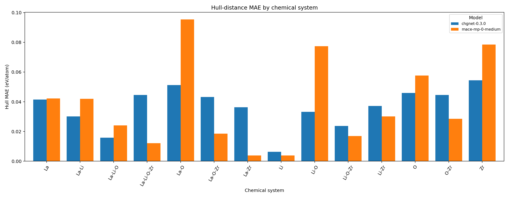

# mini-matbench-discovery-llzo

**用通用机器学习原子间势（CHGNet / MACE-MP-0 / DPA）评测 Li–La–Zr–O 相空间的热力学稳定性预测**

[English](README.md) | [简体中文](README.zh-CN.md) · 完整指标与误差归因分析：[`RESULTS.md`](RESULTS.md)

---

## 主要发现

让三种通用原子间势在**同一套协议**下跑过同一批 150 个 Li–La–Zr–O 结构，得到三个结论：

1. **富 La、富 Li 的大胞缺陷有序结构会被系统性"放平"。** 两个精确 LLZO 超胞的凸包距离被低估
   **约 60 meV/atom**（−59 ~ −63 meV/atom），且误差几乎全部来自这两个结构**自身**的形成能偏低，
   而不是竞争相被压低。→ [`RESULTS.md` §4.1](RESULTS.md)
2. **"严格稳定相"判定不可用，"50 meV/atom 候选窗口"才可用。** 严格稳定相 F1 仅 **0.444**，
   而同一批模型在 50 meV/atom 候选窗口下 F1 达 **0.813**；差距主要来自能量差仅几 meV/atom
   的金属单质多形体排序翻转。→ [`RESULTS.md` §4.3](RESULTS.md)
3. **分子晶体是最严重的失效模式，且呈双峰分布。** O₂ 分子晶体的失效簇达 **0.85–1.13 eV/atom**，
   是全数据集最大的误差簇：低能支预测良好（< 0.09 eV/atom），高能支则被一致地预测错。→ [`RESULTS.md` §4.3](RESULTS.md)



*同一批 150 个结构上，各化学体系的凸包距离 MAE，按模型分组。由 `scripts/merge_and_plot.py`
生成：只画 checkpoint 中实际存在的模型，因此两模型审计就是每体系两根柱。*

## 快速开始

只用 CHGNet，CPU 运行，除抓取快照外无需 API key：

```bash
git clone https://github.com/gyuvdvxtjq/mini-matbench-discovery-llzo.git
cd mini-matbench-discovery-llzo
python -m venv .venv && source .venv/bin/activate      # Windows 用 .venv\Scripts\activate
pip install -e .                                       # 核心依赖，含 CHGNet

cp .env.example .env                                   # 填入 MP_API_KEY
python run_audit.py --config configs/smoke.yaml --limit 12   # 约 1 分钟的冒烟检查
python run_audit.py --config configs/llzo.yaml               # 完整 150 结构审计
python scripts/merge_and_plot.py --run-dir data/runs/llzo --config configs/llzo.yaml
```

`configs/llzo.yaml` 里还列了 MACE-MP-0 和 DPA-4。缺后端的模型会记入 `report.json` 的
`skipped_models`（含缺失的包名与对应的安装脚本），不会让整个任务失败。设备按模型以 `auto`
解析（有可用 GPU 用 cuda，否则 cpu），同一份配置在笔记本和 GPU worker 上都能跑；`--device` 可强制。

`data/raw/mp_phase_space.json`（Materials Project 快照）不入库；首次运行抓取，之后离线运行。

## 跑齐三个模型

`mace-torch` 与 `deepmd-kit` 无法在同一个环境里被 pip 解析——这正是参考运行把 DPA-4 记为
`skipped_models` 而非真正跑起来的根因。解法不是强行解决冲突，而是不再强求：**每个模型跑在
自己的环境里**，事后再把两半结果拼起来。runner 的每条记录本就按
`(模型, 协议, 参数哈希, material_id)` 寻址，因此第二遍会自动跳过第一遍已算的部分。

```bash
bash cloud/run_split.sh --env mace     # chgnet-0.3.0 + mace-mp-0-medium
bash cloud/run_split.sh --env deepmd   # dpa4-mini-omat24
python3 scripts/merge_and_plot.py --run-dir data/runs/llzo --config configs/llzo.yaml
```

两个环境都会自行构建（幂等）：`cloud/setup_base.sh` 装公共栈，然后是 `cloud/setup_mace.sh`
或 `cloud/setup_deepmd.sh`——后者还会下载 DPA-4 权重（CC-BY-NC-4.0，非商用）并导出
`DPA4_CHECKPOINT`。Bohrium 批量任务用 `ENV=mace bash cloud/submit.sh` 和
`ENV=deepmd bash cloud/submit.sh` 各提交一次，再合并两份 `checkpoints.jsonl`；
完整流程见 [`cloud/README.md`](cloud/README.md)。

分批运行与一次性运行产生逐字节相同的记录，这一点由
`tests/test_pipeline.py::test_split_batches_match_a_single_run` 保证。

## 项目结构

```
.
├── mlip_audit/                  # 审计框架（配置 -> 协议 -> 指标）
│   ├── config.py                # YAML schema；路径按仓库根目录解析
│   ├── models.py                # 每种 MLIP 适配为一个 ASE calculator；设备自动探测
│   ├── mp.py                    # Materials Project 接入：key、字段、记录、快照
│   ├── protocols.py             # 单点能与晶胞弛豫，逐条 checkpoint
│   ├── md.py                    # NVT 平衡 -> NVE 生产 -> Li 扩散率
│   ├── analysis.py              # 凸包重建、稳定性指标、跨模型归因
│   ├── checkpoint.py            # 追加式 jsonl，键为 模型|协议|参数|material
│   ├── stats.py                 # bootstrap 置信区间、AUROC、safe Spearman（固定种子）
│   ├── merge.py                 # checkpoint -> 跨模型数据框、图、汇总表
│   └── runner.py                # 编排；跨批次合并 report.json
├── run_audit.py                 # CLI：--config、--model（可重复）、--device、--limit
├── scripts/merge_and_plot.py    # CLI：合并后的 checkpoint -> figures/ + 可粘进 README 的表
├── configs/                     # llzo.yaml（正式审计）、smoke.yaml（12 结构 CPU 检查）
├── tests/                       # 46 项测试；无需下载模型、无需 API key
├── cloud/                       # Bohrium 批量任务：setup_base/_mace/_deepmd、run_split、submit
├── legacy/                      # v0.1 单模型试点（已归档，对应 RESULTS.md 第 2–3 节）
├── figures/                     # 生成的跨模型图与汇总表
├── models/dpa4/                 # DPA-4 训练输入（.json）；.pt 运行时下载，不入库
├── data/runs/llzo/              # 审计结果：checkpoints.jsonl、report.json、各模型 CSV
├── pyproject.toml               # 唯一的依赖清单（extras：[mace] / [deepmd] / [dev]）
├── environment.yml              # Conda：python 3.11 + `pip install -e .`
├── CHANGELOG.md                 # 0.1 -> 0.2 -> 0.3
└── RESULTS.md                   # 完整指标、误差归因与解读（中文）
```

## 局限

- **全部是域内评测。** CHGNet 与 MACE-MP-0 的训练数据都来自 Materials Project，本项目的 150 个
  结构同样取自 Materials Project。它衡量的是工作流正确性，以及模型在**训练化学空间内**的可靠性；
  它**不构成**对 Matbench-Discovery WBM 成绩的估计——那需要独立发现集和完整协议。
- **部分类别的样本量偏小。** 严格稳定相只有 15 个正例，其 F1 的 bootstrap 区间很宽
  （[0.182, 0.667]），剔除单质后即升到 0.556。应作方向性参考；更稳健的口径是 57 个正例的
  50 meV/atom 候选窗口。
- **参考运行中三个模型只跑到两个。** 已提交的结果覆盖 CHGNet 与 MACE-MP-0；DPA-4 因上述依赖
  冲突被跳过，因此跨模型对比目前只有两个模型，且分环境方案尚未用真实 DPA-4 权重验证过。
- **异常按原样记录，不做修正。** MACE 在 O₂ 上的弛豫发生灾难性失效（−3.5e9 eV/atom，晶胞坍缩），
  单条记录就把全局凸包 MAE 拉高；该记录保留在 `report.json` 中，并在 `data/runs/llzo/NOTES.md`
  里说明。引用这个全局数字时若不排除该条，会把误差高估约 7 个数量级（其余 149 个结构为
  0.0621 eV/atom）。
- **弛豫层的能量比较只在单一元素空间内成立。** LLZO 弛豫层只在同一 `La-Li-O-Zr` 元素空间内比较
  原始总能（元素参考偏移在此抵消）；跨组分结论一律用形成能与凸包距离。

## 旧版本

v0.1 单模型试点位于 [`legacy/`](legacy/README.md)：已归档但仍可运行，因为它是
`RESULTS.md` 第 2–3 节数字的产出代码，而 `mlip_audit` 能复现它的核心数字
（CHGNet 单点凸包 MAE 0.0376 eV/atom）。

## 致谢

感谢 CHGNet、MACE 与 DPA-4 开发团队，以及 Materials Project 联盟提供的开放模型与参考数据。
DPA-4 权重采用 CC-BY-NC-4.0 许可（**非商用**）。

## 联系方式

欢迎通过 [GitHub Issues](https://github.com/gyuvdvxtjq/mini-matbench-discovery-llzo/issues) 提交问题或建议。