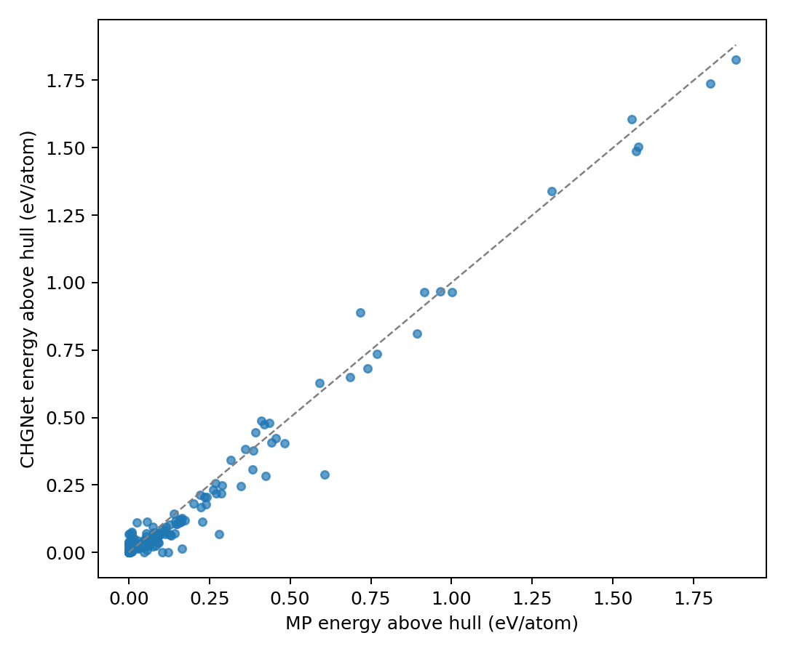
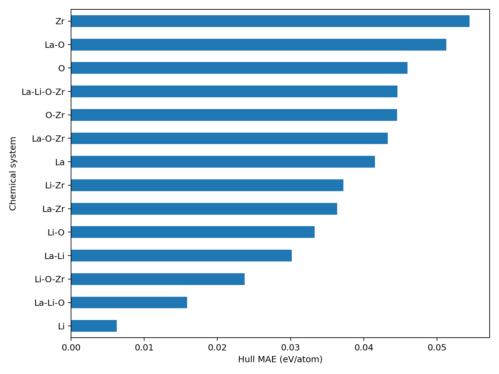

# Li-La-Zr-O 相空间与 LLZO 评测结果

## 1. 相空间稳定性评测

**本节结论：** CHGNet 在 150 个 Li、La、Zr、O 相空间结构上的形成能 MAE 为
0.0418 eV/atom、凸包距离 MAE 0.0376 eV/atom；50 meV/atom 候选分类可靠
（F1 = 0.813），严格稳定相判定受单质多形体排序翻转影响、仅作参考。

### 数据与方法

- 数据源：Materials Project API
- 范围：Li、La、Zr、O 的全部元素、二元、三元和四元化学体系
- 样本：150 个结构，覆盖 14 个有数据的子化学体系
- 模型：CHGNet `0.3.0`（软件包 `chgnet==0.4.2`）
- 推理：在 MP 的 DFT 弛豫结构上计算 CHGNet 单点能
- 稳定性：用全部 150 个 CHGNet 能量重新构建相图与凸包

### 汇总结果

| 指标 | 结果 |
| --- | ---: |
| 成功 / 失败 | 150 / 0 |
| 形成能 MAE | 0.0418 eV/atom |
| 凸包距离 MAE | 0.0376 eV/atom |
| 凸包距离 RMSE | 0.0558 eV/atom |
| 凸包距离 Spearman | 0.8645 |
| 严格稳定相 Precision / Recall / F1（正例 n=15） | 0.500 / 0.400 / 0.444 |
| 50 meV/atom 候选分类 Precision / Recall / F1（正例 n=57） | 0.758 / 0.877 / 0.813 |

严格稳定相分类只有 15 个正例，指标对小样本波动敏感：其中 3 个假阳性和 4 个漏检
来自金属单质多形体（La、Zr、Li）的能级排序翻转——CHGNet 对同一元素不同多形体
间几 meV/atom 的能量差排序与 DFT 不一致。剔除单质后（n=104），F1 从 0.444 升至
0.556。因此该指标只作参考，更稳健的口径是 57 个正例的 50 meV/atom 候选分类。
作为对照，CHGNet 官方（CHGNet 0.3.0，MPtrj 训练）在 Matbench-Discovery WBM
发现集上的成绩为 E-hull MAE 0.063 eV/atom、F1 0.613；本工作流在同一模型上得到
更低的凸包距离 MAE（0.0376），方向合理——WBM 是模型未见过的候选结构集，而这里
的 150 个结构全部来自 CHGNet 训练数据所在的 MP 化学空间，属域内评测。两组数字
协议与数据集均不同，仅作量级参照，不构成直接可比。

原始 DFT 总能与 CHGNet 能量含有不同的元素参考偏移，尤其在 La、Zr 金属体系中明显，
所以跨组分稳定性结论采用形成能和凸包距离，而不采用原始总能 MAE。

## 2. 精确 LLZO 四元结构

**本节结论：** 对 MP 仅有的 3 个精确 LLZO 四元结构，CHGNet 正确保留了三者的
非稳定相判断，但把两个富 La 结构的亚稳程度低估了约 59–63 meV/atom；
该系统性误差在第 4 节完成归因。

Materials Project 当前仅有 3 个精确 `Li-La-Zr-O` 结构。相空间模型对它们的凸包预测为：

| MP ID | 化学式 | MP E-hull | CHGNet E-hull | 误差 (eV/atom) |
| --- | --- | ---: | ---: | ---: |
| `mp-1120817` | Li17La12Zr8O48 | 0.1283 | 0.0652 | -0.0632 |
| `mp-1239180` | Li19La12Zr8O48 | 0.0932 | 0.0345 | -0.0587 |
| `mp-942733` | Li7La3Zr2O12 | 0.0068 | 0.0188 | +0.0120 |

## 3. LLZO 完整弛豫

**本节结论：** 3 个结构全部达到力收敛标准；`mp-942733` 一步收敛是模型与 DFT
几何一致性最直接的正面证据，两个富 La 结构则走了 31 步、与其更大的能量误差相互
印证。弛豫层能量误差是同化学体系内的相对比较。

配置：CPU，最多 100 个离子步，`fmax=0.1 eV/Å`，允许晶格弛豫。

| 指标 | 结果 |
| --- | ---: |
| 成功 / 失败 | 3 / 0 |
| 达到目标力阈值 | 3 / 3 |
| 弛豫能量 MAE | 0.0450 eV/atom |
| 弛豫能量 RMSE | 0.0455 eV/atom |

两点口径说明：

- **能量误差是同化学体系内的相对比较。** 三个结构同属 `La-Li-O-Zr` 单一元素空间，
  元素参考偏移在一阶上抵消；跨组分的稳定性结论以第 1、2 节的形成能和凸包距离为准，
  不使用这里的原始总能差。
- **`spearman_energy` 在 n=3 上不适用**（秩相关最少需要约 5 个点才有意义），
  因此 metrics.json 中已置空并标注 `not computed: n=3 < 5`。

一个值得记录的一致性观察：`mp-942733`（Li7La3Zr2O12，标准 LLZO 化学计量比）
在弛豫中一步收敛——初始最大原子力 0.052 eV/Å 已低于 0.1 eV/Å 的目标阈值，
CHGNet 认为 MP 的 DFT 弛豫结构几乎已处于自身势能面的极小点。这是模型与 DFT
几何一致性最好的直接证据；相比之下两个富 La 结构均走了 31 步才达到力阈值，
与其更大的能量误差相互印证。

完整数值见：

- `data/phase_space/chgnet_phase_space.csv`
- `data/phase_space/metrics.json`
- `data/chgnet_vs_mp_llzo.csv`
- `data/metrics.json`

## 4. 误差分析

### 4.1 两个富 La 结构为何被低估约 60 meV/atom

**本节结论：** 归因拆解显示，约 -60 meV/atom 的低估几乎全部来自这两个结构自身的
CHGNet 形成能偏低，竞争相一侧近乎完美抵消；差异指向大胞富 La 富 Li 缺陷构型在
训练分布中覆盖稀疏。

对三个 LLZO 组分在 MP 凸包与 CHGNet 凸包上分别做竞争相分解，并把
`E-hull 误差 = 自身形成能误差 − 竞争相凸包平面能量误差` 拆开归因：

| MP ID | E-hull 误差 | 自身形成能误差 | 竞争相平面误差 |
| --- | ---: | ---: | ---: |
| `mp-1120817` | -0.0632 | -0.0616 | +0.0086 |
| `mp-1239180` | -0.0587 | **-0.0593** | +0.0078 |
| `mp-942733` | +0.0120 | +0.0054 | +0.0052 |

结论明确：**低估几乎全部来自这两个结构自身的 CHGNet 形成能偏低**（-0.06 eV/atom），
而竞争相一侧（La2Zr2O7、Li2ZrO3、La2O3、Li2O2、Li6Zr2O7）的形成能误差都在
±25 meV/atom 以内、加权后近乎完美抵消（+0.008）。换言之，不是 CHGNet 把竞争相
压得太低，而是把这两个大晶胞富 La 相本身放得太平。

> 注：本分解为**近似归因**。"自身形成能误差 + 竞争相平面误差"与实际 E-hull 误差
> 存在约 7–10 meV/atom 残差（如 mp-1120817：-0.0616 + 0.0086 = -0.0530，
> 实际 -0.0632），原因是 MP 凸包与 CHGNet 凸包的竞争相组成不完全相同——以
> mp-1120817 为例，MP 侧含 Li6Zr2O7(0.18) 而 CHGNet 侧换成 Li2ZrO3(0.21)，权重
> 也不同；平面误差在其中一侧测得，不能精确平移到另一侧。mp-942733 因两侧分解
> 几乎一致而闭合至 ~1 meV。残差量级远小于被解释的 -60 meV 主效应，不影响结论。

两个被低估结构与一步收敛的 `mp-942733` 的区别指向同一方向：它们是 85–87 原子的
超胞、Li 过量（Li 分数 0.20–0.22，标准 LLZO 为 0.07），对应 Li 间隙缺陷有序结构。
CHGNet 训练集以 MP 收录结构为主，这类大胞、特定缺陷构型的富 La 富 Li 结构覆盖稀疏，
单点预测落在训练分布尾部时能量系统性偏负——这与第 3 节"弛豫需要 31 步而非 1 步"
（初始几何偏离模型极小点更远）相互印证。

### 4.2 全局误差结构：向零压缩

**本节结论：** 全体 150 个结构的凸包误差不是无偏噪声，而是系统性的向零压缩
（拟合斜率 0.97）：近凸包处略偏正、远凸包处显著偏负——这直接塑造了第 1 节
两类分类指标的不同表现。

150 个结构的带符号凸包误差均值为 **-0.017** eV/atom（中位数 -0.011）：整体不是
无偏噪声，而是把高能结构的相对能量往低拉。线性拟合 `E-hull(CHGNet) ≈ 0.97 ×
E-hull(MP) − 0.012`，斜率小于 1，呈典型的回归均值压缩。

分区间看得更清楚：

| MP E-hull 区间 | n | \|误差\| MAE | 带符号均值 |
| --- | ---: | ---: | ---: |
| ≤ 50 meV/atom | 57 | 0.0173 | +0.0116 |
| > 50 meV/atom | 93 | 0.0500 | -0.0348 |

近凸包处误差小且略偏正（把亚稳相抬高了 ~12 meV），远凸包处误差大且显著偏负。
这解释了第 1 节分类指标的形态：50 meV 候选窗口内召回高（0.877）但混入假阳，
严格稳定相判定则受多形体排序翻转支配。

### 4.3 两个已定位的失效模式

**本节结论：** 两个失效模式均已定位到具体结构与机理假设——金属单质多形体排序
翻转（剔除后 F1 0.444 → 0.556），以及 O2 分子晶体双峰失效（最大误差簇达
0.85–1.13 eV/atom）；两者均属方法层面的预期局限而非工作流缺陷。

**金属单质多形体的能级排序翻转。** CHGNet 对同一元素不同多形体间几 meV/atom
的能量差排序与 DFT 不一致：La 的三个多形体中它把 `mp-10023`（DFT 排最末，
E-hull=0.104）判为唯一稳定相；Zr 的六个多形体中把 DFT 排第四的 `mp-41`
（E-hull=0.122）判为稳定。严格稳定相分类的 6 个假阳性和 9 个漏检里，有 3 个假阳
和 4 个漏检来自这类单质翻转，剔除单质后 F1 从 0.444 升至 0.556。机理上这并不意外：
单质金属多形体间的能量差本就在 DFT 泛函误差与标签噪声量级（MP 对不同泛函体系
还做了 GGA/GGA+U 混合修正），CHGNet 以单一静态能量为标签，无法分辨这种细小
差异属于方法本身的预期局限。

**O2 分子晶体的双峰失效。** O 的 28 个条目里有 6 个 O2 分子晶体（含 MP 判定的
稳定氧相 `mp-1524462`）在 MP 中能量呈双峰分布：一簇在约 -4.5 ~ -4.95 eV/atom
（CHGNet 预测良好，误差 <0.09），另一簇在约 -5.7 ~ -5.97 eV/atom——CHGNet 对
后者一律给出约 -4.85 eV/atom，误差高达 0.85–1.13 eV/atom，是全数据集最大的误差簇。
低能簇正是相空间层 `largest_hull_underestimates.csv` 的主要来源（凸包距离被低估
0.15–0.21），而 `mp-2204849`（MP E-hull 仅 0.004，ε-O2 类近稳定分子晶体）则因同样
原因被 CHGNet 推高 65 meV、成为漏检。这些结构含分子内 O=O 共价键与分子间弱相互
作用的组合，属于仅靠晶体消息传递、以静态能量为标签的图神经网络难以分辨的成键类型；
这一簇同时拉高了整体 MAE，若剔除 O2 异常簇，全数据集凸包 MAE 会明显下降。

### 4.4 对筛选工作流的含义

**本节结论：** 四条可操作建议——候选粗筛用 50 meV/atom 口径、偏离化学计量比的
超胞预留更大不确定带、单质多形体排序不可直接采信、含分子单元的体系单独标记。

- 用 CHGNet 做候选粗筛时，**50 meV/atom 窗口口径可靠**（F1=0.813），但
  严格稳定相级别的判定必须交给后续 DFT。
- **富 Li/La 的大胞缺陷有序结构会被系统性"放平"**：LLZO 类材料做组分扫描时，
  对偏离标准化学计量比的超胞应预留更大的不确定带，或直接用弛豫一致性
  （初始力大小）作为置信度信号。
- 单质参考相和多形体排序不可直接采信；构建凸包时若关心的是化合物稳定性，
  可考虑用 DFT 或实验值固定元素参考点。
- 含分子单元（O2 等）的体系在当前 MLIP 外推能力之外，应单独标记。

## 5. 解释边界

CHGNet 的训练数据来自 Materials Project，而本项目的 150 个相空间结构也全部取自 MP，
因此这是一项**域内评测**：衡量的是工作流正确性，以及模型在训练数据所属化学空间中的
预测可靠性。它不回答对训练分布之外新结构的泛化能力——那需要像 Matbench-Discovery
那样在 WBM 等独立发现集上按完整协议另行评测，本文结果不构成对该成绩的估计。第 1 节
引用的 CHGNet 官方 WBM 成绩仅作量级参照：协议（单点 vs 自弛豫）、数据集与正例基数
均不同。
