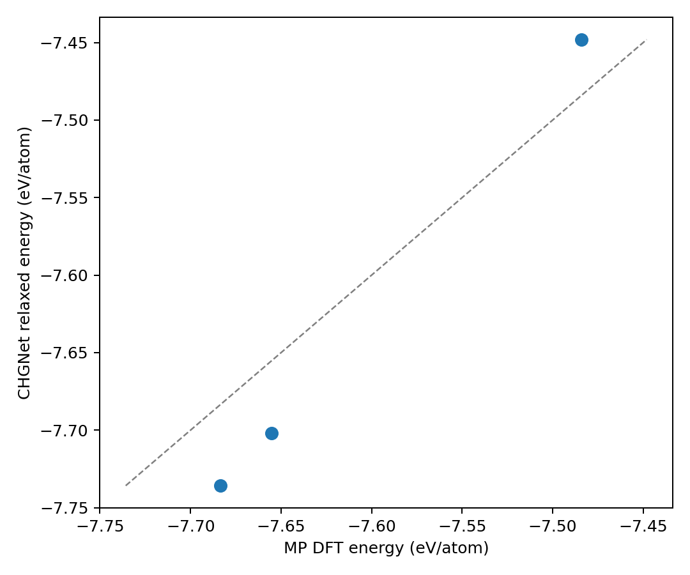
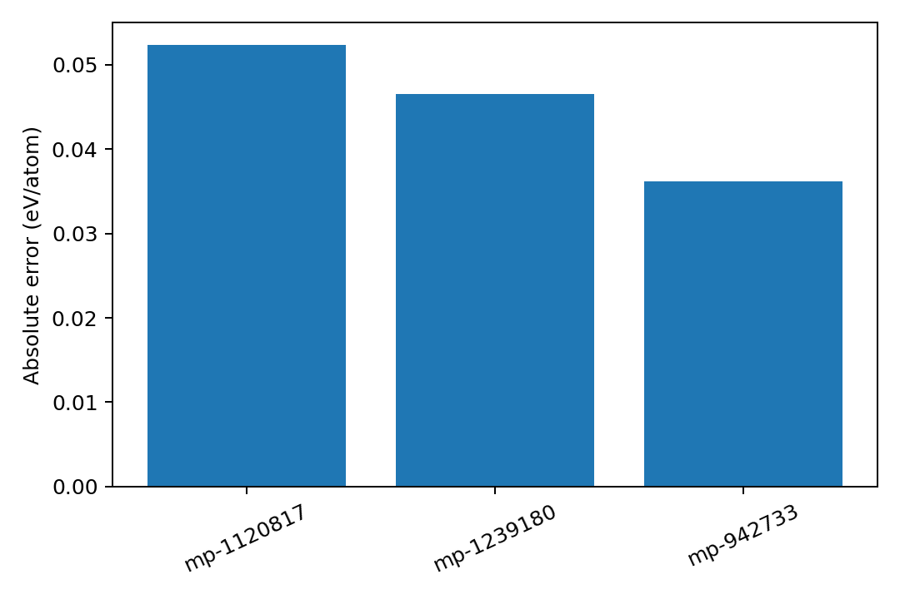

# LLZO pilot 结果

## 运行配置

- 数据源：Materials Project API
- 精确化学体系：`Li-La-Zr-O`
- 最大原子数：120
- 模型：CHGNet 预训练模型 `0.3.0`（软件包 `chgnet==0.4.2`）
- 设备：CPU
- 弛豫：最多 100 个离子步，`fmax=0.1 eV/Å`，允许晶格弛豫

## 汇总

| 指标 | 结果 |
| --- | ---: |
| MP 返回结构数 | 3 |
| 成功 / 失败 | 3 / 0 |
| 达到目标力阈值 | 3 / 3 |
| 能量 MAE | 0.0450 eV/atom |
| 能量 RMSE | 0.0455 eV/atom |
| 能量 Spearman | 1.000 |

当前 API 在该精确四元化学体系中只返回 3 个结构，因此 Spearman 仅描述这 3 个样本，
不能外推为对整个材料家族的稳定性排序能力。

## 单项结果

| Materials Project ID | 化学式 | 原子数 | 绝对能量误差 (eV/atom) | 离子步 |
| --- | --- | ---: | ---: | ---: |
| `mp-1120817` | Li17La12Zr8O48 | 85 | 0.0524 | 31 |
| `mp-1239180` | Li19La12Zr8O48 | 87 | 0.0465 | 31 |
| `mp-942733` | Li7La3Zr2O12 | 96 | 0.0361 | 1 |

完整数值及收敛信息见 `data/chgnet_vs_mp_llzo.csv` 和 `data/metrics.json`。
